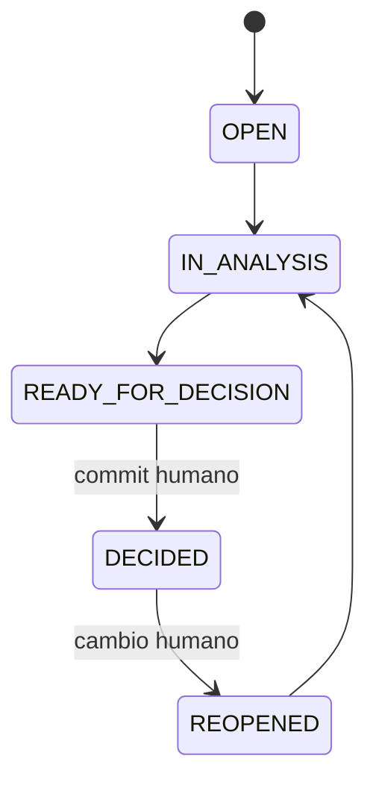

Status: canonical
Owner: Product / Engineering
Canonical: yes
Last reviewed: 2026-09-24
Related: docs/00-index/source-of-truth.md
Depends on: Master Context v1.0 + hardening brief 2026-09-24

# State Machines v1

| Objeto | Estados aprobados | Evento y actor |
|---|---|---|
| StrategicQuestion | OPEN → IN_ANALYSIS → READY_FOR_DECISION → DECIDED; DECIDED → REOPENED → IN_ANALYSIS | análisis abre User; readiness por validación; commit humano decide; reapertura humana |
| Hypothesis | UNTESTED → TESTING → SUPPORTED / WEAKENED / REJECTED | observación/revisión humana; no evidencia implica UNTESTED |
| Experiment | PLANNED → RUNNING → COMPLETED / INCONCLUSIVE / CANCELLED | User inicia y cierra; falta señal concluyente → INCONCLUSIVE |
| BrandDomainHealth | OPEN / PARTIAL / COMPLETE / NEEDS_REVIEW | proyección derivada del conjunto de Decisions/questions; NEEDS_REVIEW domina |
| Recommendation | GENERATED → ACCEPTED / MODIFIED / REJECTED / STALE | User resuelve; cambio de contexto marca stale |
| Decision | APPROVED / MODIFIED / REJECTED / NEEDS_REVIEW / INVALIDATED | MODIFIED/REJECTED describen resultado de acción humana; NEEDS_REVIEW no cambia elección; INVALIDATED sólo humano |
| DecisionVersion | APPROVED → SUPERSEDED | commit humano crea versión nueva; anterior sigue consultable |
| ReviewItem | OPEN / REVIEW_SUGGESTED / COMPLETED | HARD → OPEN y Decision NEEDS_REVIEW; SOFT puede sugerir; revisión humana completa |
| Learning | CANDIDATE → REVIEWED → ACCEPTED / REJECTED | sólo humano convierte interpretación en aprendizaje |

**Assumption in Use es relación/flag de uso de una Hypothesis por una Decision vigente, jamás status de Hypothesis.** Decision.ReviewStatus y DecisionVersion.VersionStatus tienen enums separados para no mezclar decisión, acción y versión. `REJECTED` de Recommendation no crea Decision; `REJECTED` de una propuesta Decision registra acción humana, no versión aprobada. `SUPERSEDED` sólo corresponde a versión. `INVALIDATED` exige acto humano auditado. `BrandDomainHealth` técnica que indique `IN_PROGRESS` se mapea a PARTIAL; `NOT_STARTED` se mapea a OPEN; `CURRENT` a COMPLETE sólo si no faltan decisiones requeridas ni reviews.

